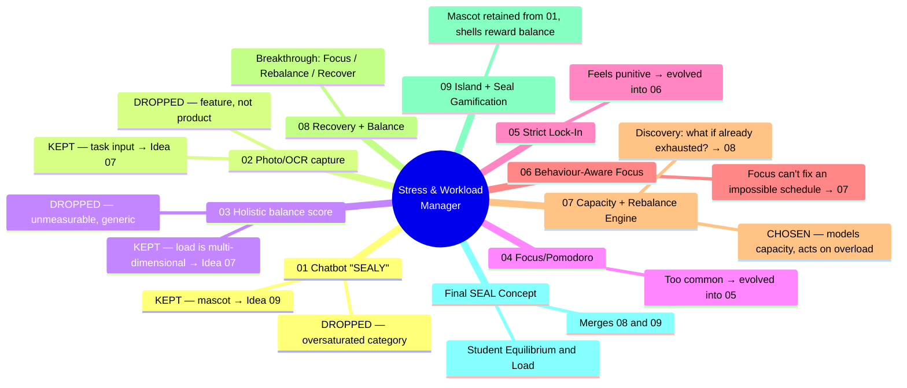
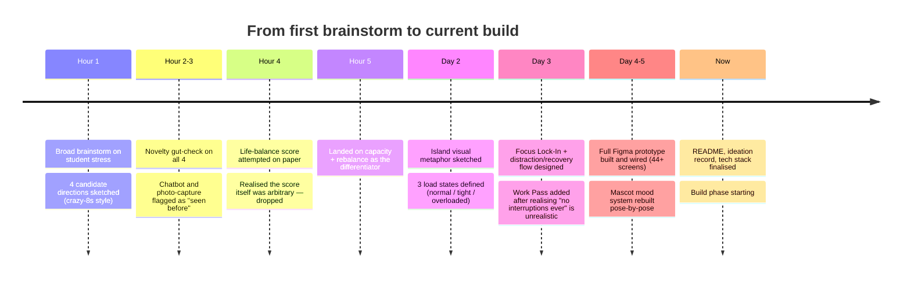
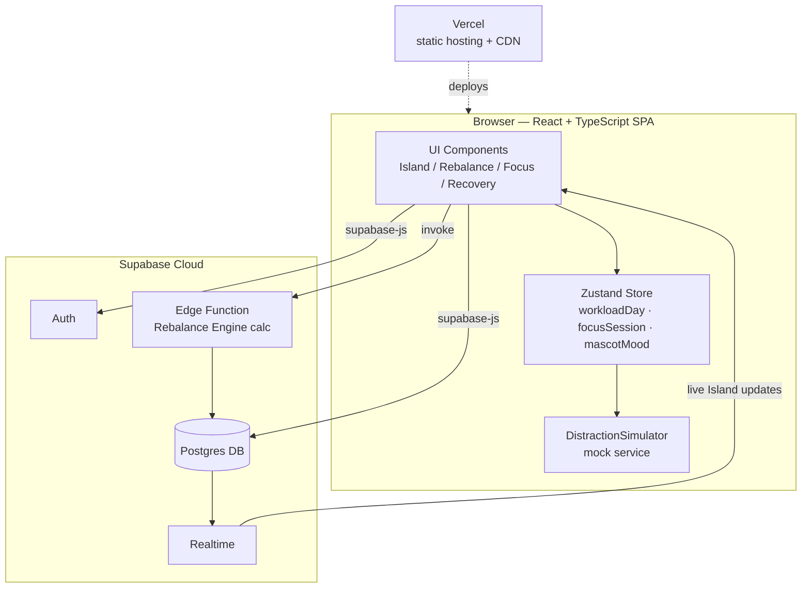
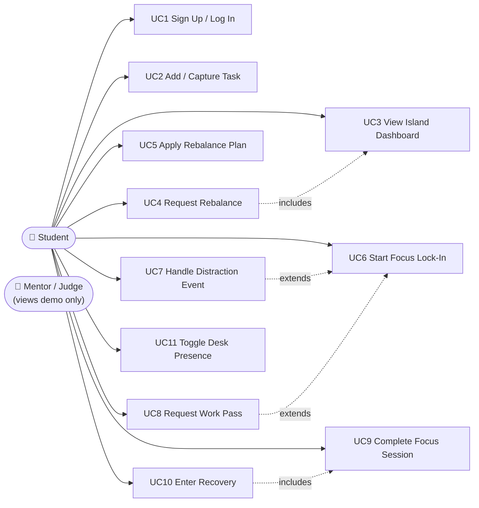
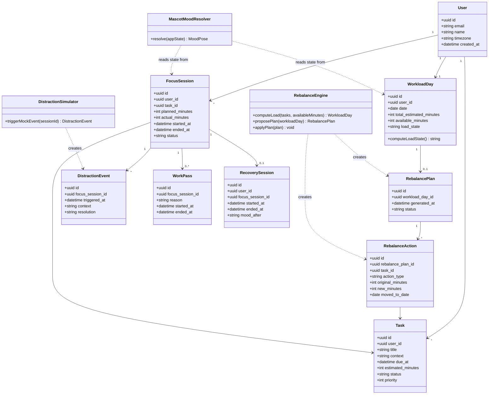
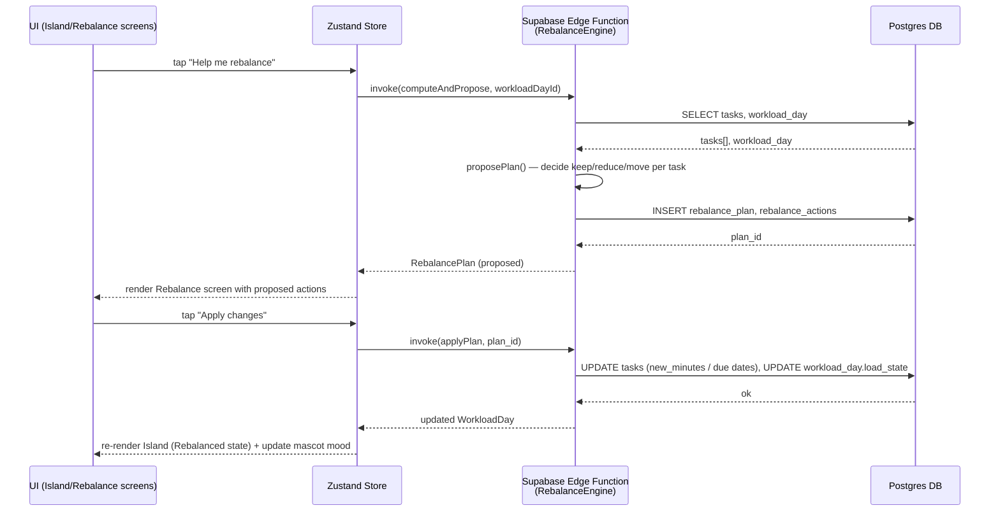
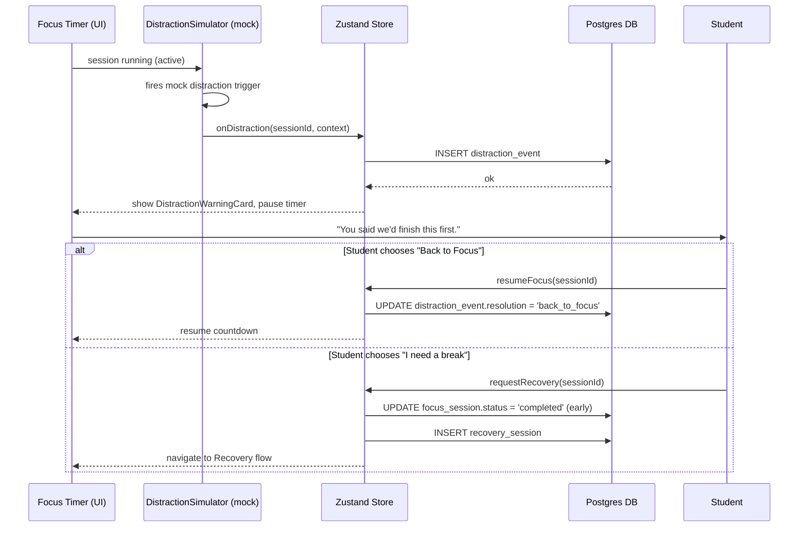
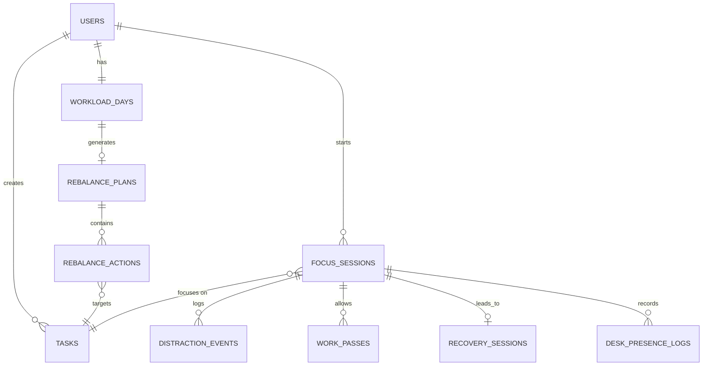

# SEAL by Kode-Nection

Team: [Member 1 — Full Stack / Backend], [Member 2 — Frontend / Product Design] <!-- TODO: swap in real names -->

Problem Statement: Stress & Workload Manager

Video Presentation: [Unlisted YouTube Link] <!-- TODO -->

Presentation Slides: [Public Link] <!-- TODO -->

---

## 1. Project Overview

### The Problem

Students juggle academic deadlines, part-time work, personal commitments and
sleep on the same 24 hours, but the tools they're given only manage the
*academic* half of that load. A calendar or to-do app will tell a student
that three assignments are due this week; it has no idea they also have a
6-hour shift and four hours of sleep debt already stacked up — so it can't
tell them they're over capacity until they've already missed something.

**Stakeholders:** students (primary user, especially those balancing study
with paid work or caregiving), universities/student-wellbeing offices (who
absorb the downstream cost — withdrawals, extension requests, counselling
demand), and indirectly parents/employers who feel the effects of a
chronically overloaded student.

**Existing tools and why they fall short:** Todoist and Notion are *task*
managers — they organise what needs doing but have no concept of a
student's remaining capacity, so they'll happily let a list grow past what
a person can physically do in the time available, with no warning. Forest
and Headspace go the opposite direction — they treat stress in isolation
from the workload causing it, so a 5-minute breathing exercise doesn't
change the fact that four assignments are still due tomorrow. Neither
category closes the loop between *what's on your plate* and *what you can
actually carry*, which is precisely the gap we chose to build in.

### Our Solution

SEAL is a student workload companion that manages *capacity*, not just
tasks. It models each day as a balance between estimated workload and
actual available time, renders that balance as a living "Island" that
visibly changes state as load rises or falls, and — the part we think
matters most — actively closes the gap when the student is over capacity,
instead of just letting the task list grow and hoping the student notices.

**Feature set:**
- **Load-aware dashboard ("Island")** — one glance shows whether today is
  fine, tight, or overloaded, expressed visually, not as a number the
  student has to interpret themselves.
- **Rebalance engine** — when overloaded, proposes concrete, reversible
  moves per task (keep / reduce / move) and applies them in one tap.
- **Focus Lock-In sessions** — a committed, timed focus block per task with
  a distraction-interruption flow that acknowledges the interruption and
  offers a real choice, instead of silently resetting or shaming the student.
- **Work Pass** — a bounded, explicit exception for when a genuine
  interruption is unavoidable, so the system works with reality instead of
  fighting it.
- **Recovery flow** — an explicit wind-down step after a demanding session,
  because load doesn't reset to zero the instant a timer ends.
- **Desk Presence awareness** — separates "distracted" from "not even
  here" during a lock-in.
- **A mascot companion** whose mood visibly tracks the student's state
  (idle, thinking, worried, celebrating, recovering) across the whole app.

---

## 2. Ideation & Process

### 2.1 Ideas We Considered

We didn't land on the final concept in a straight line — nine distinct
directions were explored, several of them in parallel, and the useful
pieces of the dropped ones were carried forward rather than thrown away.
Our filter for keeping an idea past the first pass was simple — **would a
judge (or a user) have seen this exact shape of app before?** If yes, it
went in the "dropped" pile no matter how polished it could get, because
polish doesn't fix a novelty problem. The full blow-by-blow — assumptions,
use-case diagrams, what we kept/dropped and why, at each stage — is in the
11-file FigJam network linked in §2.2; this table is the summary.

| # | Idea | Outcome |
|---|---|---|
| 01 | **SEALY Chatbot Companion** — conversational AI as the primary interface | DROPPED as the interaction model: most crowded shape on the market (dozens of student wellbeing/journaling/companion chatbots already exist), and typing is slower than tapping a dashboard for no clear benefit. **KEPT:** the emotional companion itself → evolved into the Seal mascot (see Idea 09). |
| 02 | **Photo/OCR Task Capture** — camera → syllabus/whiteboard → tasks | DROPPED as the core product: a genuinely useful *feature*, not a product; OCR-to-task already exists elsewhere and would have eaten build time without touching the real problem. **KEPT:** the fast task-input concept → feeds the Load Engine (Idea 07). |
| 03 | **Holistic Life-Areas Balance Score** — one score across academics/work/social/sleep | DROPPED: a single score with no shared unit is arbitrary, and it's the most generic pitch of the set. **KEPT:** the underlying discovery that load is multi-dimensional (Five Load Dimensions) → feeds the Load Engine (Idea 07). |
| 04 | **Focus / Pomodoro** — a standard focus-timer intervention | Too common, only solves procrastination, assumes "work" is always the right answer → evolved into Idea 05. |
| 05 | **Strict Lock-In** — block distracting apps, allow work apps | Reduces temptation but can feel punitive and doesn't ask *why* the student is distracted → evolved into Idea 06. |
| 06 | **Behaviour-Aware Focus** — understand focus/procrastination patterns | Useful, but surfaced a bigger problem: even perfect focus can't fix a schedule that doesn't fit (e.g. 2h 40m available, 3h 35m of work required) → led to Idea 07. |
| 07 | **Capacity + Rebalance Engine ★ CHOSEN ★** — model what the student can realistically carry (tasks + calendar + deadlines + free time), then keep / reduce / move what doesn't fit | Kept because it's the only concept where the core mechanic — modelling remaining *capacity* and *acting* on overload, not just flagging it — wasn't already something else on the market. Task managers track tasks; wellness apps track mood; nothing we found tracked the gap and closed it. Surfaced a further question: "what if the student is already exhausted?" → led to Idea 08. |
| 08 | **Recovery + Balance** — SEAL should sometimes tell the student *not* to work | Major conceptual breakthrough: interventions become **FOCUS / REBALANCE / RECOVER**, not just "work harder." → merges into the Final concept. |
| 09 | **Island + Seal Gamification** — a virtual island represents life balance (Mental→Weather, Time→Lighthouse, Physical→Vegetation, Social→Beach, Errands→Dock); the Seal is the mascot retained from Idea 01 | Makes the state legible at a glance instead of another dashboard; shells are earned for *balance*, not endless work → merges into the Final concept. |

**Final SEAL Concept** — *Student Equilibrium & Load*, tagline "Keep your
life afloat." Five Loads × three interventions (Focus / Rebalance /
Recover), driven by Calendar/Tasks/Check-ins/Focus History/Usage Data, and
expressed through the Island / Seal Companion / Insights / Shell Rewards
experience layer.

### Team & Role Split

We're a 2-person team, so we split by layer rather than by feature, to avoid
both of us blocking on the same file:

| Member | Primary responsibility | Owns |
|---|---|---|
| **[Member 1 name]** — Backend & Data | Supabase schema, auth, the Rebalance Engine's logic, the mocked Distraction/Presence simulator, deployment | Everything in `services/`, `lib/supabase.ts`, the database migrations, and the sequence-diagram flows in §5 |
| **[Member 2 name]** — Frontend & Product Design | React components, the Figma → code translation, the mascot pose system, the overall UX polish | Everything in `components/` and `pages/`, the Figma prototype itself, the mascot sprite pipeline |

<!-- TODO: swap in real names above; adjust the split if it doesn't match
how you're actually dividing the work. -->

### 2.2 Ideation Boards

Two versions of the same ideation trail, in case one renders better for you
than the other:

**A — inline, in this README** (guaranteed to render on GitHub, no external
link to break):





**B — the real FigJam network** (one Main Hub + one file per idea, all
cross-linked with clickable navigation):

All 11 files live in the **Sealy** team's **figjam** project folder.

| File | Link |
|---|---|
| **Main Hub** — brainstorm-style overview, all 9 ideas cross-linked into Final | https://www.figma.com/board/IzgiS7JIiu6L6mi7dsSoga |
| 01 Chatbot Companion | https://www.figma.com/board/kODR5FXZe6ln27mRbUDIkV |
| 02 Photo/OCR Task Capture | https://www.figma.com/board/xyq1xbZWRMeaQlR0LZz5ch |
| 03 Holistic Life Balance | https://www.figma.com/board/fliaUZm9Grb6hiEr6ozEXk |
| 04 Focus/Pomodoro | https://www.figma.com/board/UyevwwpsSdYu2r1CfXgP9c |
| 05 Strict Lock-In | https://www.figma.com/board/D0w8RgpbVAI2qRIxfWkhkS |
| 06 Behaviour-Aware Focus | https://www.figma.com/board/Vbq3HT39GnVxr34mDfXDLG |
| 07 Capacity + Rebalance Engine | https://www.figma.com/board/LHiaomOlQUwuqjxvVENWhV |
| 08 Recovery + Balance | https://www.figma.com/board/ZEALlyR7lwnBjdHgGahZNu |
| 09 Island + Seal Gamification | https://www.figma.com/board/z3zfW7O2rg0UYnW5ZAFilV |
| Final SEAL Concept | https://www.figma.com/board/iBVX4pAcKUPuNpuEijOWuM |

The Main Hub shows the *shape* of the exploration — sticky notes, crossed-
out directions, arrows showing what was kept vs. dropped, colour-coded
(blue = problem/question, pink = idea being explored, red = dropped,
green = kept, purple = new evolution, yellow = question/discovery). Each
separate file goes deep on one idea: summary, problem at that point,
assumptions, features at that time only, a simple user flow, a use-case
diagram scoped to that stage, good things, limitations, the questions that
led to the next idea, and what was kept/dropped/changed.

<!-- TODO before submitting: open each of the 11 files above → Share → set
link access to "Anyone with the link can view", and confirm each opens in
an incognito window. -->

<!-- I couldn't pull FigJam's screenshot bytes into this repo myself (this
sandbox's network doesn't reach figma.com's asset CDN — same limit noted
for the mascot artwork). If you want static images as a fallback in case a
judge's Figma link doesn't open, screenshot the Main Hub yourself and drop
it in as `ideation-hub.png`, then uncomment the line below. -->
<!--  -->

### 2.3 Mentor Consultation

| Date | Mentor | Feedback Received | What Was Changed |
|---|---|---|---|
| 2026-09-09 | Lim Zi Yang | [TODO — fill in from last night's 20:00 session] | [TODO] |

<!-- Don't skip this even if you disagreed with something Zi Yang said —
"we heard this and chose not to change X because Y" is a fully valid row. -->

---

## 3. Design & Prototype

UI Prototype: [Public Figma Link] <!-- TODO: Share → "Anyone with the link
can view" → test in an incognito window → paste here. -->

1. **Login / Welcome** — entry point; mascot greets the student.
2. **Island Dashboard — High Load** — today's workload vs. available time
   as a visibly strained Island; overdue-soon tasks listed below it.
3. **Rebalance** — the proposed keep/reduce/move changes, shown before the
   student commits.
4. **Island Dashboard — Rebalanced** — the same Island, visibly calmer,
   after the plan is applied.
5. **Active Lock-In** — a running focus session, countdown visible, mascot
   present ("Don't touch me.").
6. **Distraction Warning** — triggered mid-session; the mascot reacts, and
   the student gets a real choice instead of a guilt message.
7. **Focus Complete** — session summary: time focused, XP earned.
8. **Recovery Complete** — the wind-down step before returning to the Island.

---

## 4. What Makes It Different

- **Capacity, not just tasks.** The Island renders remaining *capacity*
  directly — the visual degrades under load instead of requiring the
  student to do arithmetic on a task count.
- **A rebalance engine that acts, not just advises.** Keep / reduce / move
  is applied in one tap — the student isn't handed a list of suggestions
  they still have to manually execute.
- **Distraction as a designed moment, not a failure state.** The interrupt
  flow acknowledges what happened and offers a genuine choice, instead of
  silently resetting a timer.
- **An escape valve that doesn't fight reality.** Work Pass exists because
  assuming a student will never need their phone mid-session is
  unrealistic — it's a bounded, explicit way to step out instead of being
  ignored or bypassed.
- **Emotional continuity via the mascot.** The same character's mood tracks
  the student's actual state end-to-end, so the app doesn't go emotionally
  flat at the exact moments the student is least resourced to parse plain UI.

| | Todoist / Notion | Forest / Headspace | **SEAL** |
|---|---|---|---|
| Models remaining capacity (not just a list) | ❌ | ❌ | ✅ |
| Acts on overload automatically | ❌ | ❌ | ✅ |
| Designs for the mid-task distraction moment | ❌ | partial (blocks apps, no re-entry flow) | ✅ |
| Gives an explicit, bounded exception path | ❌ | ❌ | ✅ |

---

## 5. Technical Architecture & Feasibility

### Development methodology

We're running this as a 5-day Agile sprint (daily stand-up, daily working
build) rather than a big-bang build at the end. Design and the working
README function as a **living spec** — every build task traces back to a
section in this document, and we update the doc the same day a decision
changes, instead of letting code and plan drift apart. Where we've used
Claude as an AI pair-programmer during the build, we're doing it
spec-anchored (spec written and reviewed by us first, agent implements
against it, we review the diff) rather than "vibe coding" straight from a
prompt with no record of the decision — mainly because we want to be able
to explain *why* every part of this system exists, to a mentor or a judge,
without pointing at a black box.

### Tech stack

| Layer | Choice | Why | Constraint to expect |
|---|---|---|---|
| Frontend | **React + TypeScript + Vite**, styled with **Tailwind CSS** | Fastest realistic path from the Figma prototype to a running web demo for a 2-person team in ~3 days; TypeScript catches the kind of state-shape bugs (task/rebalance/session objects) that are easy to introduce under time pressure; Tailwind lets us match the Figma spacing/colour tokens quickly without hand-rolling CSS. | No native mobile app — the demo is a responsive web app. Acceptable because the judged deliverable is a video + README, not an app-store listing. |
| State management | **Zustand** | Minimal boilerplate compared to Redux; a single small store for `workloadDay`, `focusSession`, `mascotMood` is enough for this scope — we don't need Redux's middleware ecosystem for a 5-day build. | None significant at this scale. |
| Backend / API | **Supabase client SDK called directly from the frontend**, no separate custom server | Supabase's row-level security (RLS) policies do the authorization work a hand-written REST API would otherwise need, which removes an entire layer we'd otherwise have to build and secure ourselves in 3 days. | RLS policies must be written carefully — a missing policy silently exposes or blocks data rather than throwing an obvious error. We'll write one Supabase Edge Function only if we need genuine server-side logic (e.g. the Rebalance Engine's calculation) that shouldn't run on the client. |
| Database | **Supabase Postgres** | Free tier, built-in auth, realtime subscriptions (useful for the Island updating live), and a relational model fits our data (users → tasks → focus sessions) much better than a document store. | Free tier has row/storage/connection limits — comfortably enough for a demo, not for production scale; we'll say so plainly if asked. |
| Auth | **Supabase Auth** (email/password to start) | Comes free with the same platform, no separate integration. | Social login (Google, etc.) is a nice-to-have we're explicitly cutting for time — see Build plan below. |
| Hosting | **Vercel** (frontend), **Supabase Cloud** (DB/auth/backend) | Both have generous free tiers and near-zero-config deploys from a GitHub repo — a `git push` redeploys, which matters when we're iterating daily. | Cold-start latency on Supabase free tier can make the very first request of a demo feel slightly slow — worth doing a "wake it up" request 5 minutes before presenting live. |
| Presence / distraction detection | **Mocked** — a `DistractionSimulator` module with manually-triggerable events, matching what's already wired in the Figma prototype (invisible demo-trigger hotspots) | Real OS-level usage-tracking (iOS Screen Time API, Android `UsageStatsManager`) is permission-gated, platform-specific, and not reachable from a web app at all — attempting it for real would consume most of the remaining build time on a piece that isn't the core differentiator. | We say this openly in the video/demo rather than pretending it's real — judges consistently respect an honest "this is mocked, here's how we'd build the real thing" more than a shaky attempt at the real integration. |
| Design → build bridge | **Figma** (prototype + exported mascot pose assets), **Claude** (AI-assisted implementation against this README as spec) | Already built; screens and the mascot sprite system translate directly into React components. | None — this part is done. |

<!-- TODO: I don't have the specific hackathon-project examples you
mentioned in front of me right now — if you want the stack tuned to match
their style exactly, paste them in and I'll adjust. The table above is a
standard, defensible 2-person/5-day hackathon stack on its own. -->

### System architecture diagram



### Build plan & scope

**Will build for the demo:**
- [ ] Auth (email/password) + onboarding
- [ ] Island dashboard with High Load / Rebalanced / Recovered states
- [ ] Rebalance flow (keep / reduce / move), backed by a real Edge Function
- [ ] Focus Lock-In with the mocked `DistractionSimulator`
- [ ] Recovery flow
- [ ] Mascot mood system driven by real app state

**Explicitly out of scope for the hackathon build (cut deliberately, not
by accident):**
- [ ] Real OS-level distraction/desk-presence detection (mocked instead —
      see Tech stack table)
- [ ] Social login
- [ ] Native mobile app (web-responsive only)
- [ ] Photo/OCR task capture (see §2.1 — dropped at the ideation stage, not
      a build-phase cut)

---

<details>
<summary><strong>📐 Detailed system design (click to expand) — use case diagram, class diagrams, sequence diagrams, ER diagram &amp; data dictionary, package structure</strong></summary>

### Use Case Diagram



### Use Case Descriptions

| ID | Use Case | Actor | Preconditions | Main Flow | Postconditions |
|---|---|---|---|---|---|
| UC1 | Sign Up / Log In | Student | None | Student enters credentials → Supabase Auth validates → session created | Student is authenticated, redirected to Island |
| UC3 | View Island Dashboard | Student | Authenticated | System computes `workloadDay` (estimated vs available minutes) → renders Island in matching load state | Student sees current load state (normal/tight/overloaded) |
| UC4 | Request Rebalance | Student | `load_state = overloaded` | Student taps "Help me rebalance" → Edge Function computes a `RebalancePlan` (keep/reduce/move per task) → plan shown for review | A proposed, not-yet-applied `RebalancePlan` exists |
| UC5 | Apply Rebalance Plan | Student | A proposed plan exists | Student taps "Apply changes" → each `RebalanceAction` is written to `tasks`/`workload_days` → Island re-renders | `workload_day.load_state` recalculated (typically improves) |
| UC6 | Start Focus Lock-In | Student | A task selected | Student picks a duration → `FocusSession` created with `status=active` → timer starts | An active `FocusSession` exists |
| UC7 | Handle Distraction Event | Student | `FocusSession.status=active` | `DistractionSimulator` fires (mock) → `DistractionEvent` logged → warning card shown → student chooses "back to focus" or "I need a break" | Session resumes or transitions to Recovery |
| UC8 | Request Work Pass | Student | `FocusSession.status=active` | Student taps "Need your phone?" → `WorkPass` created with a start time → session pauses | Bounded exception window open; session resumes on return |
| UC9 | Complete Focus Session | Student | `FocusSession.status=active` | Timer reaches 0 or student ends early → `FocusSession.status=completed`, `actual_minutes` recorded | XP/summary shown |
| UC10 | Enter Recovery | Student | A `FocusSession` just completed | `RecoverySession` created → wind-down screen shown → student taps "Return to Island" | Student returned to Island dashboard |
| UC11 | Toggle Desk Presence | Student | `FocusSession.status=active` | Student (or simulator) toggles presence → `desk_presence_log` row written | Distinguishes "distracted" from "not at desk" for analytics |

### Domain / Design Class Diagram



### Sequence Diagram — Rebalance Flow



### Sequence Diagram — Distraction Handling During Focus Lock-In



### Entity-Relationship Diagram



### Data Dictionary

**`users`**

| Field | Type | Constraints | Description |
|---|---|---|---|
| id | uuid | PK | Supabase auth user id |
| email | text | unique, not null | Login identifier |
| name | text | not null | Display name |
| timezone | text | default 'UTC' | Used for `due_at`/day-boundary calculations |
| created_at | timestamptz | default now() | |

**`tasks`**

| Field | Type | Constraints | Description |
|---|---|---|---|
| id | uuid | PK | |
| user_id | uuid | FK → users.id | |
| title | text | not null | |
| context | text | nullable | e.g. course name |
| due_at | timestamptz | not null | |
| estimated_minutes | int | not null, > 0 | Student- or system-estimated effort |
| status | text | enum: pending / in_progress / done | |
| priority | int | default 0 | Used as a tiebreaker in `proposePlan()` |

**`workload_days`**

| Field | Type | Constraints | Description |
|---|---|---|---|
| id | uuid | PK | |
| user_id | uuid | FK → users.id | |
| date | date | not null | |
| total_estimated_minutes | int | computed | Sum of that day's `tasks.estimated_minutes` |
| available_minutes | int | student-set or default | Remaining free time that day |
| load_state | text | enum: normal / tight / overloaded | Drives the Island's visual state |

**`rebalance_plans`**

| Field | Type | Constraints | Description |
|---|---|---|---|
| id | uuid | PK | |
| workload_day_id | uuid | FK | |
| generated_at | timestamptz | default now() | |
| status | text | enum: proposed / applied / dismissed | |

**`rebalance_actions`**

| Field | Type | Constraints | Description |
|---|---|---|---|
| id | uuid | PK | |
| rebalance_plan_id | uuid | FK | |
| task_id | uuid | FK | |
| action_type | text | enum: keep / reduce / move | |
| original_minutes | int | | |
| new_minutes | int | nullable | Set when `action_type = reduce` |
| moved_to_date | date | nullable | Set when `action_type = move` |

**`focus_sessions`**

| Field | Type | Constraints | Description |
|---|---|---|---|
| id | uuid | PK | |
| user_id | uuid | FK | |
| task_id | uuid | FK | |
| planned_minutes | int | not null | |
| actual_minutes | int | nullable | Filled on completion |
| started_at / ended_at | timestamptz | | |
| status | text | enum: active / completed / abandoned | |

**`distraction_events`**

| Field | Type | Constraints | Description |
|---|---|---|---|
| id | uuid | PK | |
| focus_session_id | uuid | FK | |
| triggered_at | timestamptz | | |
| context | text | | Mocked "app" name for the demo |
| resolution | text | enum: back_to_focus / took_break | |

**`work_passes`**

| Field | Type | Constraints | Description |
|---|---|---|---|
| id | uuid | PK | |
| focus_session_id | uuid | FK | |
| reason | text | | |
| started_at / ended_at | timestamptz | | |

**`recovery_sessions`**

| Field | Type | Constraints | Description |
|---|---|---|---|
| id | uuid | PK | |
| user_id | uuid | FK | |
| focus_session_id | uuid | FK | |
| started_at / ended_at | timestamptz | | |
| mood_after | text | nullable | Optional self-report |

**`desk_presence_logs`**

| Field | Type | Constraints | Description |
|---|---|---|---|
| id | uuid | PK | |
| focus_session_id | uuid | FK | |
| status | text | enum: present / absent | |
| logged_at | timestamptz | | |

*(Mascot mood is deliberately **not** a database table — it's a pure
client-side function, `MascotMoodResolver.resolve(appState)`, that maps
whatever's already in the store to a pose. Keeping it derived rather than
stored avoids an entire class of "mood out of sync with reality" bugs.)*

### Package / Folder Structure

```
src/
├── components/         # Island, RebalanceCard, FocusTimer, MascotAvatar,
│                        # DistractionWarningCard, WorkPassSheet, ...
├── pages/               # Login, Signup, Onboarding, Dashboard, Rebalance,
│                        # Focus, Recovery, Insights, Settings
├── services/
│   ├── rebalanceEngine.ts       # calls the Supabase Edge Function
│   ├── focusSessionService.ts
│   ├── distractionSimulator.ts  # mocked — manual trigger for the demo
│   └── mascotMoodResolver.ts    # pure function: appState -> pose
├── hooks/                # useWorkloadDay, useFocusSession, useAuth
├── store/                # Zustand stores
├── lib/
│   ├── supabaseClient.ts
│   └── types.ts          # shared TS types mirroring the data dictionary
└── assets/
    └── mascot/           # pose sprites exported from the Figma component library
```

</details>

---

<!-- ================================================================
     PUNCH LIST — remove this section before submitting.
     ================================================================ -->

## ⚠️ Internal punch list (delete before submitting)

**Still needed for submission (by 13 Sept, 23:59):**
- [ ] Real member names (currently placeholders in 2 spots)
- [ ] Fill in 2.3 with what Zi Yang actually said last night, and what (if
      anything) changed as a result
- [ ] Public, incognito-tested Figma share link
- [ ] Actual build — even a thin working slice beats a Figma-only
      submission on the feasibility/technical criteria
- [ ] FigJam ideation board — link once built (see §2.2 note)
- [ ] ≤5-minute unlisted YouTube video: problem → solution → why novel →
      how it'll be built → why it deserves to be built. Don't spend time
      walking through ideation on video — that's graded from this README
      only, per the organiser's note.
- [ ] Public slides link
- [ ] Make the GitHub repo public with this README.md at the root
