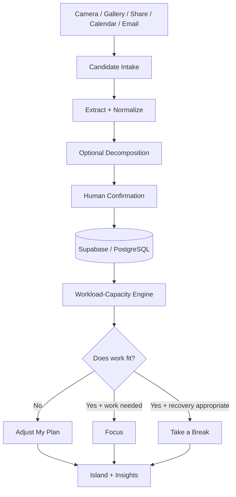

# SEAL — Extended Submission & Technical Notes

> This file is an extended companion to the root [README](README.md). It is **not** the Word submission draft. The active product is **SEAL — Student Equilibrium & Load**; SEALY is retained only when documenting the archived v1 chatbot direction.

## One-sentence pitch

**SEAL helps a student import scattered academic responsibilities, compare the work that still needs to be done with the time they actually have left, and choose whether to focus, adjust the plan, or take a break.**

## Why the concept changed

The project did not begin with this exact form. The ideation history matters because several attractive ideas were deliberately narrowed or dropped.

| Idea | Decision | What survived |
|---|---|---|
| SEALY chatbot companion | Dropped as the primary interface | Seal mascot / emotional layer |
| OCR/photo task capture | Dropped as the whole product; revisited after Mentor #1 | Low-friction import mechanism |
| Holistic five-load score | Dropped as one composite score | Context signals only |
| Pomodoro/focus timer | Too narrow alone | Focus intervention |
| Strict app lock | Too punitive / technically constrained | Explicit pause-selected-apps concept |
| Behaviour-aware focus | Useful but insufficient | Insight that focus cannot fix an impossible schedule |
| Capacity + Rebalance Engine | Core concept | Work-to-finish vs time-left reasoning |
| Recovery | Kept | Take-a-break intervention |
| Island + seal | Kept as experience layer | Visual state + mascot |

### The turning point

> **Even perfect focus cannot fix an impossible schedule.**

If a student needs **3h35** of work but has only **2h40** left, another timer does not solve the problem. The plan has to change.

## Current product model

```text
LOW-FRICTION INPUT
Camera · Gallery · Share · Calendar · Email · Paste
                    ↓
             Candidate Intake
                    ↓
      Extract / structure / normalize
                    ↓
       Optional task decomposition
                    ↓
           Human confirmation
                    ↓
       Work to finish vs time left
                    ↓
          Recommendation layer
          ┌────────┼────────┐
        FOCUS    ADJUST   TAKE A BREAK
```

“Rebalance” remains an internal product-design term, but **Adjust My Plan** is the preferred student-facing wording after Mentor #2.

## Current prototype data story

The newest Figma flow is deliberately concrete:

```text
ISP640 Project Plan             90m
ICT652 presentation prep        65m
ASC486 Group Project            60m
                               ----
Work to finish                3h35m
Time left today               2h40m
Shortfall                       55m
```

The UI exposes the work behind the total so the user does not have to trust a mysterious pressure score.

### After adjustment

One later-deadline item is moved out of today:

```text
Work after plan               2h35m
Time left today               2h40m
Spare                            5m
```

This is representative prototype data. It demonstrates the arithmetic model; it is not live data processing.

## Student-facing vocabulary

| Internal / earlier term | Preferred UI wording |
|---|---|
| Required workload | Work to finish |
| Available capacity | Time left today / Time you have |
| Rebalance | Adjust My Plan |
| Recover | Take a Break |
| Task decomposition | Break it down |
| Recommended intervention | SEAL suggests |
| Schedule pressure | Explain the concrete shortfall instead |

Design rule:

> **Complex underneath. Simple on screen.**

## Current adjustment interaction

The task menu has exactly four choices:

1. **Keep** — no task change. A confirmation screen explains that SEAL leaves the item as planned.
2. **Add** — SEAL generates another arrangement. Five prototype arrangements are available so the student can cycle before confirming.
3. **Move** — a phone-style week calendar demonstrates drag-to-another-slot behaviour. If a drop creates an overlap, SEAL warns the student. The current prototype rule permits at most two concurrent items and asks for confirmation when an overlap would be created.
4. **Defer** — asks whether the deadline changed or the task is simply no longer urgent. A changed deadline routes back into calendar placement.

## Focus-mode clarity

Mentor #2 identified an ambiguity: if TikTok and Instagram are listed as blocked, what happens to apps that are not listed?

The prototype now states the rule explicitly:

> **Only apps the user selects are paused. Everything else remains available during Focus.**

This is the conceptual rule. Native OS-level app blocking remains a future / platform-dependent technical feature, not a current implementation claim.

## Plan views

The Plan flow now has a clickable **Today / Week** switch.

The week screen follows a phone-calendar mental model and shows:

- day columns;
- time rows;
- course blocks;
- course code/name;
- lecturer context where available;
- duration;
- urgent deadline block;
- task preview linking into detail.

The demo uses academic PDFs supplied during prototyping to keep course and deadline examples coherent.

## Insights views

The prototype now contains distinct:

- **7 Days**
- **30 Days**
- **Semester**

views. The 30-day and semester tabs no longer route to a note saying the feature would be built later. Each has its own metrics and period framing.

These are still fixed prototype values, not analytics generated from live history.

## Intended architecture



### Intended stack

- React Native + Expo + TypeScript
- Supabase + PostgreSQL + Auth + RLS
- Zustand
- TanStack Query
- Google Calendar API (read-only first)
- Expo Notifications
- OCR/text-recognition provider to be finalized
- deterministic recommendation rules for the MVP
- AI assistance only where it improves extraction/decomposition/explanation

## MVP / Stretch / Future

### MVP concept

- import via OCR/photo
- Calendar read-only
- structured task/event model
- user confirmation
- effort + deadline data
- work-to-finish vs time-left calculation
- Focus / Adjust / Take-a-Break recommendation
- basic Island state
- Today / Week plan

### Stretch

- richer task decomposition
- Share-to-SEAL
- Telegram bot/API intake
- richer behaviour insights
- more advanced OCR
- Desk Presence experiment

### Future

- authorised headless-browser adapter for supported portals
- more autonomous multi-source aggregation
- native app blocking / Screen Time integrations
- system-wide usage signals
- wearables
- advanced personal agent

## Mentor consultation summary

### Mentor #1

Key challenge: **reduce user effort**. The response was to revisit OCR as input, add structured extraction/decomposition, explore agentic intake, and keep users in control.

### Mentor #2 — Janelle

Key challenge: **make the core visible without explanation**. The response was to simplify vocabulary, expose the 55-minute shortfall and its source tasks, simplify the action menu, make Plan/Week and Insights demonstrable, and clarify app-pause behaviour.

See [`docs/mentor-feedback/mentor-02-sep12.md`](docs/mentor-feedback/mentor-02-sep12.md).

## Prototype status

The Figma prototype is the current implementation evidence. There is no corresponding production application in this repository.

**Designed / simulated:** import, OCR interpretation, plan, week calendar, workload/time comparison, adjustment flows, focus configuration, island, 7/30-day/semester insights.

**Not technically implemented:** real OCR, live calendar API, persistence, native app blocking, real drag-and-drop scheduling, AI agent, real analytics.

## Presentation spine

A concise judge/mentor walkthrough should be:

1. Students' work is scattered.
2. SEAL reduces the effort of reconstructing it.
3. Here are the actual tasks causing **3h35** of work.
4. The student only has **2h40** left.
5. Therefore SEAL says **55 min short**, not a vague pressure score.
6. **Adjust My Plan** offers Keep / Add / Move / Defer.
7. Once the plan fits, SEAL can recommend Focus.
8. If continuing is not appropriate, it can recommend Take a Break.
9. The Island and Insights make the result easy to read over time.

## Accuracy rules

- Do not claim burnout detection or diagnosis.
- Do not call the five original dimensions scientifically validated load scores.
- Do not claim autonomous portal access is implemented.
- Do not claim app blocking is technically working because the Figma flow exists.
- Do not present demo course PDFs as user research.
